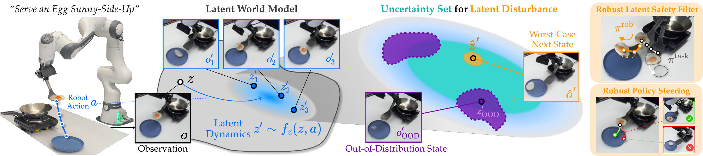

<p align="center">

</p>

<h1 align="center"><strong>Modeling Latent Disturbances</strong><br>for Robust Decision-Making in World Models</h1>

> [Junwon Seo](https://junwon.me/), [Andrea Bajcsy](https://www.cs.cmu.edu/~abajcsy/) · Carnegie Mellon University

<p align="center">
  <a href="https://junwon.me/LatentDisturbance/"></a>
  <a href="LICENSE"></a>
</p>

---
<div align="center">

</div>

**LUCID** models latent-space disturbances as perturbations to the learned latent dynamics within a calibrated
uncertainty set, inducing pessimistic yet plausible imaginations for robust decision-making in world models.

---

## Modules

| Module | Domain | World Model | Disturbance |
|--------|--------|-------------|-------------|
| [`latentdisturbance/`](latentdisturbance) | Shared | DreamerV3 / RSSM | Latent disturbance, calibration, adversarial RL |
| [`dubins/`](dubins/README.md) | Image-based 3D Dubins car | RSSM, Gaussian latents | Naughty or positional |
| [`block_pouring/`](block_pouring/README.md) | Block Pouring (Isaac Lab) | DreamerV3, categorical latents | Randomized block physics |
| [`egg/`](egg/README.md) | Sunny-side-up egg serving (Franka) | DINOv3 + transformer RSSM | Spatula surface friction |

## 🛠️ Installation

```bash
conda create -n latentdisturbance python=3.10 -y && conda activate latentdisturbance
pip install torch==2.5.1 torchvision==0.20.1 --index-url https://download.pytorch.org/whl/cu121
pip install -r requirements.txt
export PYTHONPATH=$PWD:$PYTHONPATH
```

This covers Dubins, the egg and all training, and provides the `hf` command used below. Block Pouring also needs Isaac Lab; see [INSTALL.md](INSTALL.md).
All commands are run from the repo root.

## 📦 Download

Checkpoints and data are on Hugging Face ([checkpoints](https://huggingface.co/junwon-seo/LatentDisturbance),
[data](https://huggingface.co/datasets/junwon-seo/LatentDisturbance-data)). Download what you need into the repo root:

```bash
# Dubins
hf download junwon-seo/LatentDisturbance --include "checkpoints/dubins/*" --local-dir .
# Block Pouring
hf download junwon-seo/LatentDisturbance --include "checkpoints/block_pouring/*" --local-dir .
hf download junwon-seo/LatentDisturbance-data --repo-type dataset --include "data/block_pouring/teleop_replay/*" --local-dir .
# Egg (plus the DINOv3 weights, see INSTALL.md)
hf download junwon-seo/LatentDisturbance --include "checkpoints/egg/*" --local-dir .
hf download junwon-seo/LatentDisturbance-data --repo-type dataset --include "data/egg/traj/*" --local-dir .
```

| Path | Size | Contents |
|------|------|----------|
| `checkpoints/dubins/` | 0.7 GB | world models and filters (naughty, positional) |
| `checkpoints/block_pouring/` | 1.1 GB | world model, LUCID and Nominal filters, Diffusion Policy |
| `checkpoints/egg/` | 0.8 GB | world model, filter, normalization |
| `data/block_pouring/teleop_replay/` | < 1 MB | recorded teleoperations for the Nominal vs. LUCID demo |
| `data/egg/traj/` | 1.2 GB | real robot episodes |
| `data/block_pouring/` | 13.3 GB | offline dataset, only needed for training |

## 🚀 Quick Start

> Start with the Dubins car: it only needs `checkpoints/dubins/` and runs in a few minutes on one GPU.

```bash
python dubins/visualize.py --config dubins/configs/reach_naughty.yaml \
    --run checkpoints/dubins/filter_naughty --step 90000 --out naughty.png
```

This plots the learned robust safety value next to the ground-truth backward reachable tube. See
[`dubins/README.md`](dubins/README.md) for evaluation and training.

### 🧱 Block Pouring

```bash
python block_pouring/run_filter.py --policy diffusion --episodes 5
```

Safeguards a Diffusion Policy in Isaac Sim and saves videos to `logs/block_pouring/demo/`. See
[`block_pouring/README.md`](block_pouring/README.md).

### 🍳 Egg Serving

```bash
python egg/filter_video.py --episodes data/egg/traj --max_episodes 1
```

Replays a real robot episode through the robust safety filter and saves a video to `logs/egg/videos/`. See
[`egg/README.md`](egg/README.md).

## 🛡️ Train a Robust Latent Safety Filter

```bash
# 1. calibrate the uncertainty set on held-out trajectories
python -m latentdisturbance.calibrate --config <task>/configs/reach.yaml --calib_data <held-out data>
# 2. train the robust safety value and safety policy
python -m latentdisturbance.train --config <task>/configs/reach.yaml
```

Update `kl_radius` and `ood_threshold` in the config with the values printed by step 1. The released configs
hold the values used for the released filters. `--use_disturbance False` trains the **Nominal** baseline.

## ❤️ Acknowledgements

- [DreamerV3](https://arxiv.org/abs/2301.04104), via the PyTorch port [NM512/dreamerv3-torch](https://github.com/NM512/dreamerv3-torch)
- [UNISafe](https://github.com/CMU-IntentLab/UNISafe): *Uncertainty-aware Latent Safety Filters for Avoiding Out-of-Distribution Failures* (CoRL 2025)
- [Isaac Lab](https://github.com/isaac-sim/IsaacLab), [DPPO](https://github.com/irom-princeton/dppo) and [DINOv3](https://github.com/facebookresearch/dinov3)

## ⭐ Citation

If this work helps your research, please consider citing:

```bibtex
@misc{seo2026latentdisturbance,
  title={Modeling Latent Disturbances for Robust Decision-Making in World Models},
  author={Seo, Junwon and Bajcsy, Andrea},
  year={2026},
  url={https://junwon.me/LatentDisturbance/}
}
```
