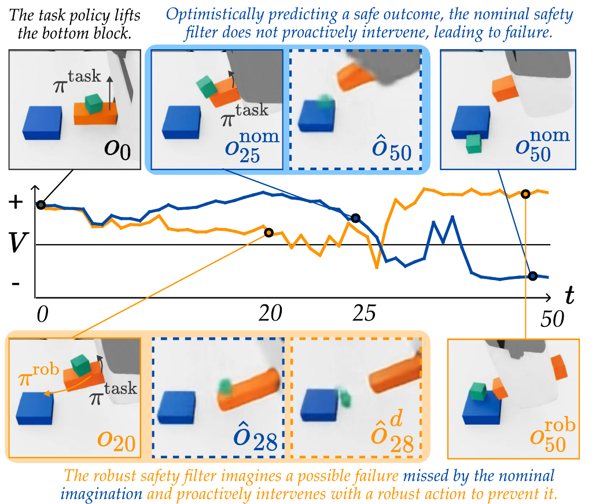
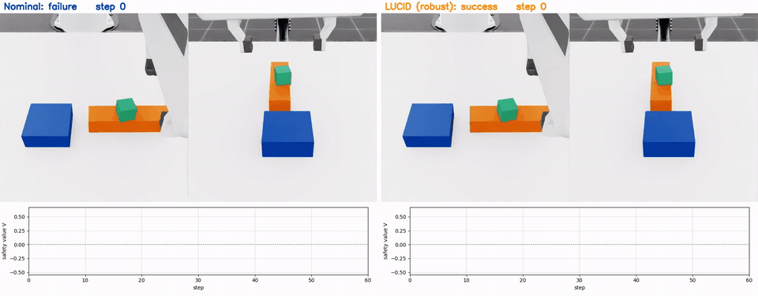
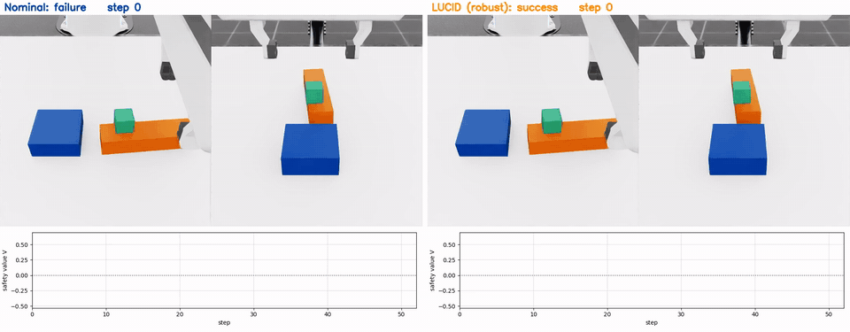

# LUCID / Block Pouring

> Robust latent safety filtering for vision-based Block Pouring in Isaac Lab.
> 🌐 [Project page](https://junwon.me/LatentDisturbance/)

<p align="center">
  
</p>
<p align="center"><em><b>Safety value: Nominal vs. LUCID.</b> The robust safety filter proactively intervenes based on a plausibly
pessimistic imagination, while the nominal safety filter overestimates safety and intervenes too late.</em></p>

---

A Franka must pick up and tilt the orange block so that the green block on top slides onto the blue block. The
green block's mass, friction and restitution are randomized and never observed. The world model is DreamerV3 with
categorical latents, and the task policy is a Diffusion Policy.

---

## 🛠️ Installation

The `isaaclab` environment: Isaac Sim 4.5.0 and Isaac Lab v2.1.0 with `isaaclab.patch`, plus DPPO for the Diffusion
Policy ([INSTALL.md](../INSTALL.md)). Download `checkpoints/block_pouring/` and
`data/block_pouring/teleop_replay/` ([Download](../README.md#-download)).
All commands are run from the repo root.

---

## 🚀 Quick Start

### Nominal vs. robust on the same teleoperation

Replays recorded teleoperations under the Nominal filter and LUCID, from the same initial state and physics:

```bash
python block_pouring/compare_filters.py
```

Videos are written to `logs/block_pouring/compare/`.

<p align="center"></p>
<p align="center"></p>
<p align="center"><em>Nominal (left, blue when it intervenes) vs. LUCID (right, orange when it intervenes) at the same step.
LUCID intervenes early and the green block lands on the blue block; the Nominal filter intervenes too late and the
block falls.</em></p>

### Safeguard the Diffusion Policy

```bash
python block_pouring/run_filter.py --policy diffusion --episodes 5
```

Videos are written to `logs/block_pouring/demo/`. Add `--use_filter False` to run the policy without the filter.

### Safeguard your own teleoperation

With a display and a 3Dconnexion SpaceMouse:

```bash
python block_pouring/run_filter.py --policy spacemouse --gui
```

---

## 🏗️ Full Training Pipeline

<details>
<summary>Click to expand</summary>

Download the offline dataset (SpaceMouse demonstrations and rollouts with randomized physics):

```bash
hf download junwon-seo/LatentDisturbance-data --repo-type dataset --include "data/block_pouring/*" --local-dir .
```

The dataset has 2,821 files; if Hugging Face stops the download with a rate-limit error (429), wait a few
minutes and run the same command again, it resumes.

```bash
# (optional) collect more demonstrations with a SpaceMouse (K saves the episode, L discards it)
python block_pouring/collect_demos.py --out data/block_pouring/my_demos
# world model, PENN ensemble and OOD score
python block_pouring/train_wm.py --config block_pouring/configs/wm.yaml --out checkpoints/block_pouring/wm.pt
# calibrate the uncertainty set, then train the robust latent safety filter
python -m latentdisturbance.calibrate --config block_pouring/configs/reach.yaml --calib_data <held-out episode dir>
python -m latentdisturbance.train --config block_pouring/configs/reach.yaml
# Diffusion Policy (DPPO codebase, successful episodes of rollouts_0804)
bash block_pouring/diffusion_policy/train_policy.sh
```

Update `kl_radius` and `ood_threshold` in `configs/reach.yaml` with the values printed by `calibrate`.
Add `--use_disturbance False` to train the **Nominal** filter.

</details>
