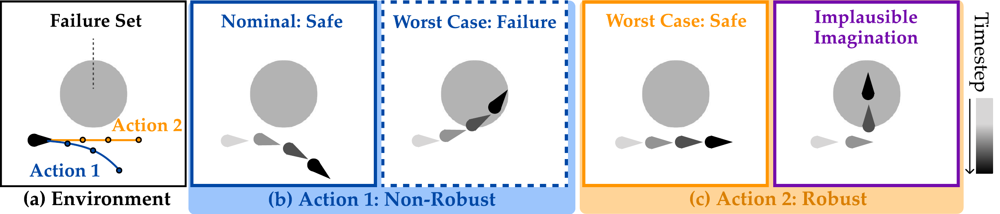
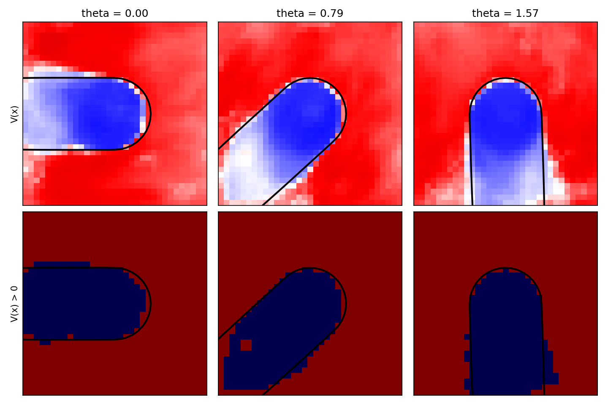
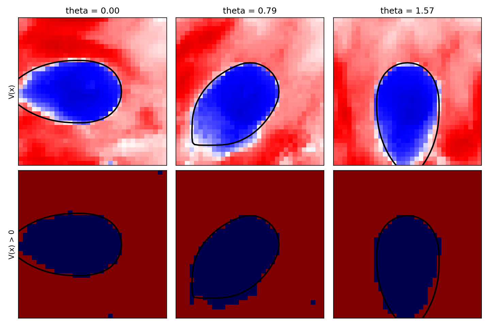

# LUCID / 3D Dubins Car

> Robust optimization in the world-model latent space, validated against ground-truth robust solutions.
> 🌐 [Project page](https://junwon.me/LatentDisturbance/)

<p align="center">
  
</p>
<p align="center"><em><b>Naughty 3D Dubins Car.</b> (a) Environment with the vehicle and a failure set at the center. (b) For an action
sequence that turns right, an adverse disturbance can instead drive the vehicle into failure, making the decision
non-robust. (c) Driving straight remains safe even in the worst case. However, an implausible imagination can make this
robust action appear unsafe.</em></p>

---

A discrete-time 3D Dubins car (v = 1 m/s, Δt = 0.05 s, |a| ≤ 1.25 rad/s), observed only through 128×128 images,
must avoid a failure set at the center. It evolves under two types of disturbances:

| Variant | Disturbance | Ground-truth BRT |
|---------|-------------|------------------|
| **naughty** | the system randomly flips the sign of the action, a discrete, multimodal transition distribution with two outcomes per action | worst case: the controller cannot steer |
| **positional** | continuous d<sub>x,t</sub>, d<sub>y,t</sub> ∈ [-0.3, 0.3]: x<sub>t+1</sub> = x<sub>t</sub> + Δt [v cos θ<sub>t</sub> + d<sub>x,t</sub>, v sin θ<sub>t</sub> + d<sub>y,t</sub>, a<sub>t</sub>] | worst-case bounded disturbance, d = 0.3 |

For both settings, the ground-truth safety value and robust action are computed with grid-based HJ reachability,
which lets us evaluate the latent disturbance learned by LUCID.

- **World model**: Dreamer with an RSSM whose latent dynamics are Gaussian, trained offline on random
  action–disturbance trajectories of T = 100 steps. Each observation is labeled with the binary failure margin
  (−1 inside the failure set, 1 otherwise), and an MLP on the latent state predicts the latent failure margin ℓ(z).
- **Latent disturbance**: takes the mean and covariance predicted by the nominal latent dynamics and outputs additive
  perturbations to both. ε<sub>KL</sub> and ε<sub>OOD</sub> are calibrated on held-out trajectories with α = 0.01.
- **Evaluation**: the safety value V is scored by how well it classifies unsafe states on a grid over (x, y, θ),
  reported as balanced accuracy (B.Acc.), FPR and FNR.

<p align="center">
  
  
</p>
<p align="center"><em>Released filters: robust safety value on (x, y) slices at three headings, with the ground-truth BRT
boundary in black. Left: naughty · Right: positional. Top: V(x), bottom: V(x) > 0 (blue = safe).</em></p>

---

## 🛠️ Installation

The `latentdisturbance` environment ([Installation](../README.md#️-installation)). Download
`checkpoints/dubins/` ([Download](../README.md#-download)). All commands are run from the repo root.

---

## 🚀 Quick Start

Score the released filters against the ground-truth BRTs (balanced accuracy, FPR, FNR):

```bash
python dubins/eval_value.py --config dubins/configs/reach_naughty.yaml \
    --run checkpoints/dubins/filter_naughty --step 90000
python dubins/eval_value.py --config dubins/configs/reach_positional.yaml \
    --run checkpoints/dubins/filter_positional --step 85000
```

Expected (paper, LUCID): B.Acc. 0.958 / FPR 0.037 / FNR 0.046 (naughty) and 0.956 / 0.023 / 0.066 (positional).
The released filters give ≈0.96 for both; numbers vary slightly between runs because latents are sampled.
A grid point is predicted unsafe when V(x) < 0; the BRT value < 0 is the true unsafe set.

Plot value slices like the figure above:

```bash
python dubins/visualize.py --config dubins/configs/reach_naughty.yaml \
    --run checkpoints/dubins/filter_naughty --step 90000 --out naughty.png
```

---

## ⚙️ Key Arguments

`eval_value.py` and `visualize.py` take the filter's training config plus:

| Argument | Default | Description |
|---|---|---|
| `--config` | — | `reach_naughty.yaml` or `reach_positional.yaml` (selects the world model and BRT) |
| `--run` | — | directory with `actor/critic1/critic2/disturbance-<step>.pth` |
| `--step` | — | checkpoint step |
| `--out` | none (eval) / `dubins_value.png` (visualize) | JSON metrics or figure path |
| `--thetas` | `[0.0, 0.785, 1.571]` | headings shown by `visualize.py` |

Filter settings live in `configs/reach_naughty.yaml` and `configs/reach_positional.yaml`.

---

## 🏗️ Full Training Pipeline

<details>
<summary>Click to expand</summary>

### 1. Generate data

5,000 training and 500 calibration trajectories of 100 steps per variant:

```bash
python dubins/generate_data.py --mode naughty --out data/dubins/naughty
python dubins/generate_data.py --mode positional --out data/dubins/positional
```

This writes `<out>_train.hdf5` and `<out>_calib.hdf5`.

### 2. Train the world model

Trains the RSSM (Gaussian latents) on the first 4,800 trajectories, then the logpZO OOD score on its latents:

```bash
python dubins/train_wm.py --config dubins/configs/wm.yaml \
    --dataset_path data/dubins/naughty_train.hdf5 --out checkpoints/dubins/wm_naughty.pt
python dubins/train_wm.py --config dubins/configs/wm.yaml \
    --dataset_path data/dubins/positional_train.hdf5 --out checkpoints/dubins/wm_positional.pt
```

### 3. Calibrate the uncertainty set

Trajectory-level conformal calibration of ε_KL and ε_OOD (α = 0.01) on the held-out set:

```bash
python -m latentdisturbance.calibrate --config dubins/configs/reach_naughty.yaml \
    --calib_data data/dubins/naughty_calib.hdf5
```

Update `kl_radius` (ε<sub>KL</sub>) and `ood_threshold` (ε<sub>OOD</sub>) in the reach config with the printed values; the
released configs hold the values used for the released filters.

### 4. Train the robust latent safety filter

```bash
python -m latentdisturbance.train --config dubins/configs/reach_naughty.yaml
python -m latentdisturbance.train --config dubins/configs/reach_positional.yaml
```

Checkpoints go to `logs/dubins/reach/<run>/model/`; evaluate them as in Quick Start.
Add `--use_disturbance False` for the **Nominal** baseline.

### 5. Ground-truth BRTs (optional)

`brt/` already contains the BRTs. To regenerate them (needs `jax` and `hj_reachability`):

```bash
python dubins/solve_brt.py --mode worstcase --out dubins/brt/worstcase_v1_w1.25.npy
python dubins/solve_brt.py --mode disturbance --dist_bound 0.3 --out dubins/brt/disturbance_v1.0_w1.25_d0.3.npy
```

</details>
