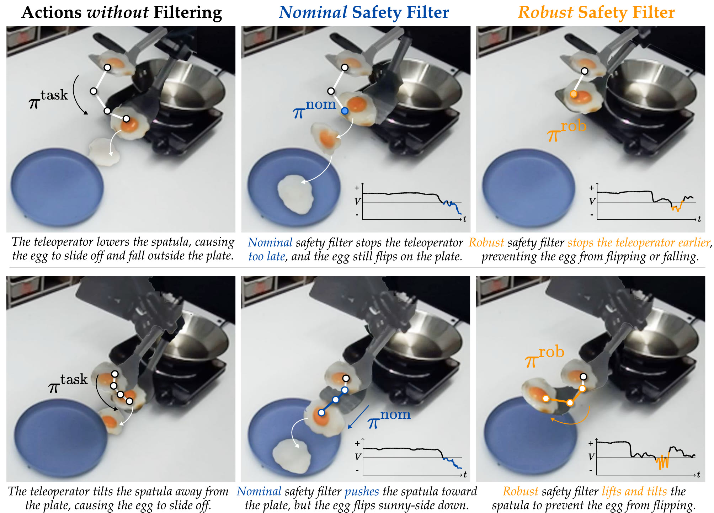
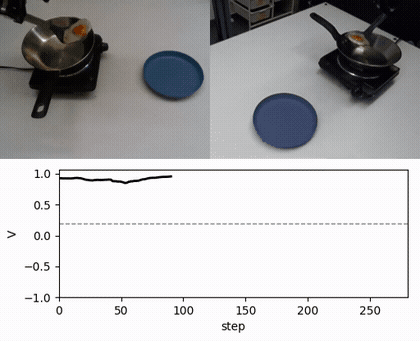
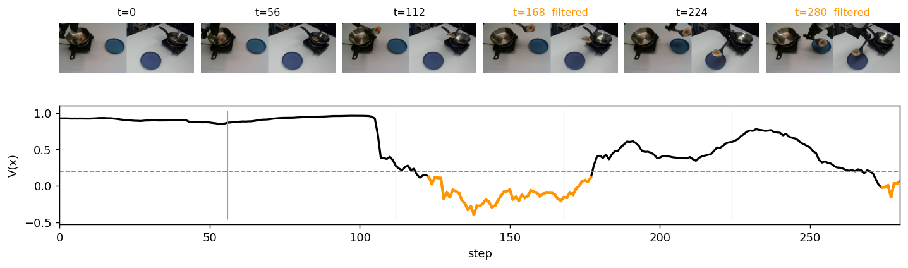

# LUCID / Serving Sunny-Side-Up Fried Eggs

> Robust latent safety filtering on a real Franka Research 3.
> 🌐 [Project page](https://junwon.me/LatentDisturbance/)

<p align="center">
  
</p>
<p align="center"><em><b>Preventing a sunny-side-down egg.</b> LUCID preemptively identifies teleoperator actions that may cause the egg
to fall or flip and intervenes with robust actions that remain safe under worst-case dynamics.</em></p>

---

The robot must serve a sunny-side-up egg from a spatula onto a plate without dropping or flipping it, while the
egg's friction on the spatula is unobserved. The world model is an RSSM on frozen DINOv3 features with transformer
latent dynamics.

<p align="center">
  
</p>
<p align="center"><em>A recorded robot episode replayed through the released filter; orange frames are steps where the filter intervened.</em></p>

---

## 🛠️ Installation

The `latentdisturbance` environment ([Installation](../README.md#️-installation)). Download
`checkpoints/egg/` and `data/egg/traj/` ([Download](../README.md#-download)), and the DINOv3 ViT-S/16+ weights
(see [INSTALL.md](../INSTALL.md)).
All commands are run from the repo root.

---

## 🚀 Quick Start

Replay the recorded robot episodes through the released filter and render videos:

```bash
python egg/filter_video.py --episodes data/egg/traj --out logs/egg/videos
```

Plot one episode:

```bash
python egg/visualize.py data/egg/traj/traj_0000_20260814_113436_success.npz \
    --signals logs/egg/videos/traj_0000_20260814_113436_success.npz --out egg.png
```

<p align="center"></p>
<p align="center"><em>Key frames and the safety value V; shaded steps are where the filter intervened.</em></p>

| Argument | Default | Description |
|---|---|---|
| `--episodes` | `data/egg/traj` | directory of recorded episodes |
| `--out` | `logs/egg/videos` | output directory |
| `--max_episodes` | `0` (all) | only replay the first N episodes |

---

## 🏗️ Full Training Pipeline

<details>
<summary>Click to expand</summary>

The teleoperated training data is not part of this release; the expected hdf5 format is documented in
[`data.py`](data.py).

```bash
# normalization statistics
python egg/norm_stats.py --dirs data/egg/<dir> ... --out checkpoints/egg/norm_stats.json
# world model, then OOD scores, then failure heads
python egg/train_wm.py --config egg/configs/wm.yaml --phase wm --out checkpoints/egg/wm_phase1.pt
python egg/train_wm.py --config egg/configs/wm.yaml --phase ood --init checkpoints/egg/wm_phase1.pt --out checkpoints/egg/wm_phase2.pt
python egg/train_wm.py --config egg/configs/wm.yaml --phase labels --init checkpoints/egg/wm_phase2.pt --out checkpoints/egg/wm.pt
# calibrate the uncertainty set, then train the robust latent safety filter
python -m latentdisturbance.calibrate --config egg/configs/reach.yaml --calib_data data/egg/<held-out dir>
python -m latentdisturbance.train --config egg/configs/reach.yaml
```

Update `kl_radius` and `ood_threshold` in `configs/reach.yaml` with the values printed by `calibrate`.
Training needs the DINOv3 ViT-S/16+ weights (see [INSTALL.md](../INSTALL.md)).
The default world-model batch (20 × 64) does not fit on a 24 GB GPU; add `--batch_size 4` there.

</details>
